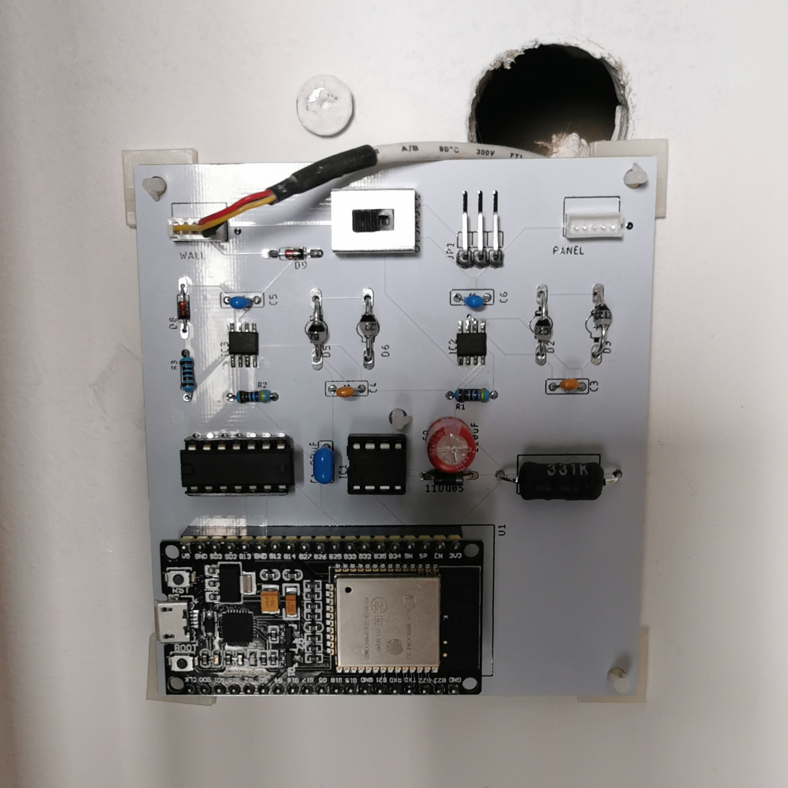

<!--
SPDX-FileCopyrightText: 2021 Diego Elio Pettenò

SPDX-License-Identifier: 0BSD
-->

# LG PQRCUDS0 compatible ESPHome Component

This repository contains the source code and the EAGLE design files for using
[ESPHome](https://esphome.io/) to control a LG air conditioning unit that uses
the PQRCUDS0 control panel.

The source code and an example configuration package are in the `esphome/`
directory, while the `eagle/` directory has the PCB design files.

Note that this project is neither endorsed, nor sponsored, by either of LG
or the ESPHome project.

You can find details of the implementation and some of the choices made in the
design on my blog: https://flameeyes.blog/tag/lg/

See also:

* Python utilities to emulate the panel and engine at
    <https://github.com/Flameeyes/lg-PQRCUDS0-emu>
* [Saleae Logic](https://www.saleae.com/) high-level analyzer for the
  protocol, at <https://github.com/Flameeyes/saleae-extension-LG-PQRCUDS0>

## Features

The custom component needs [Home Assistant](https://www.home-assistant.io/),
to provide a reference temperature, as it does not provide its own temperature
sensor.

Once provided a reference temperature sensor, the component supports the
following features, tested on my flat's HVAC system (LG ARNU07GB1G2):

* Cool, heat, fan-only, dehumidifer, and heat-cool modes, with two-point set
  temperature.

* Fan speed selection (low/medium/high), including "off" speed for idling in
  heat-cool mode.

## Board Revision History

### Rev 1

Original production design. It provided support to host the panel to the side
for going back to the panel on request, with a cutoff switch.

The cutoff had problems with holding the HVAC unit and the panel in sync when
switching away from the ESP32, so it never really worked.

The other reason to keep te panel powered up would have been to maintain a
readout of the temperature from the panel's on-board temperature sensor, but
it does not appear to be very reliable or useful, being able to report only
between 18C and 30C.

### Rev 2

A size- and cost-reduced variant of the original board, with the same logic
design, but without the secondary bus (and related components), and replacing
the cutoff switch with a pushbutton that turns off the whole board.

The bus connector is now on the back of the board, to make it easier to access
from the wall itself.

## License

Both the custom component and the EAGLE design files are released under the
permissive 0BSD license. This means you can reuse them pretty much as you may
want to.

Do note that ESPHome libraries are licensed under GNU GPLv3, so combining them
with logic in the components is still subject to the full license.

## Boxes

The `boxes/` directory contains 3D printable files for a box compatible with
the rev2 board.

Since this is literally my first 3D design, take it with a grain of salt,
it particularly suffers from the following minor issues:

* The cover vents on the top are not shaped to keep into consideration the
  registration corners.
* The central screw is unnecessary as (at least with Nylon SLS print) it is
  perfectly possible to keep the box closed by friction-fitting it.
* There should be a little more clearance for the ESP32 module, by raising
  the top of the cover.
* There's no compatible cap to fit into the pushbutton. A different strategy
  should be pursued.
* The keyholes should be more tolerant, as screws are often not quite aligned
  as they should be.
